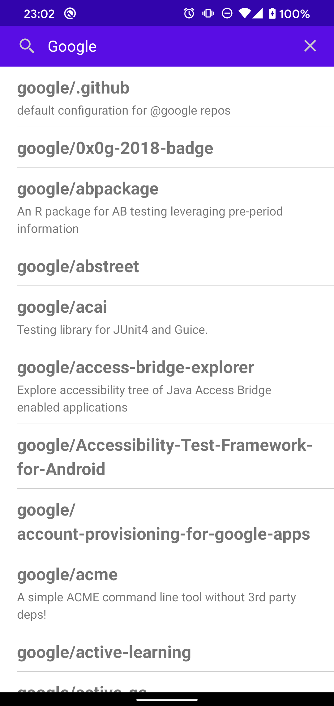
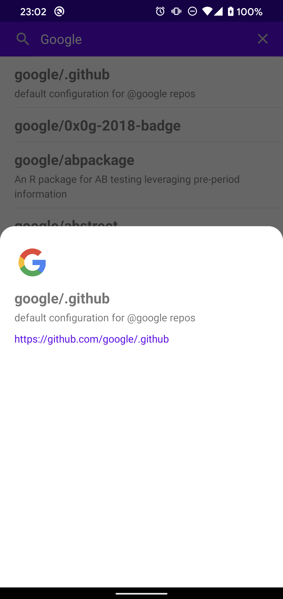
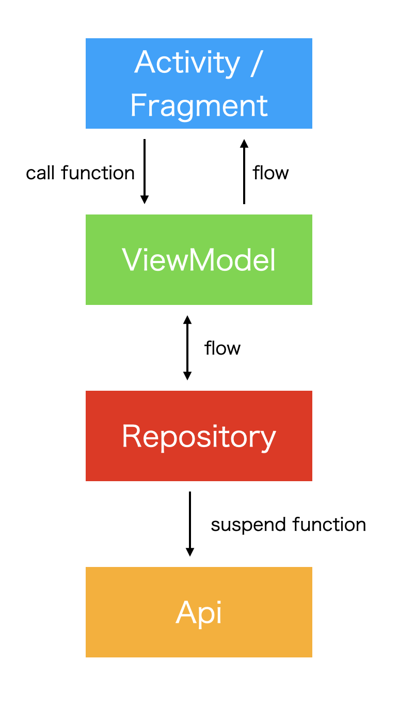

# Android MVVM sample app that uses kotlin coroutines flow (without LiveData)
This is a sample app that uses kotlin coroutines [flow](https://kotlinlang.org/docs/reference/coroutines/flow.html).

It is MVVM Architecture without [LiveData](https://developer.android.com/topic/libraries/architecture/livedata).

There is a user search feature on Github.

## Screenshot
top|detail
:--:|:--:
|

## Architecture


### ViewModel -> View
Use kotlin coroutines flow with [ConflatedBroadcastChannel](https://kotlin.github.io/kotlinx.coroutines/kotlinx-coroutines-core/kotlinx.coroutines.channels/-conflated-broadcast-channel/).

After transformed to hot stream with [ViewModelScope](https://developer.android.com/topic/libraries/architecture/coroutines#viewmodelscope), bind to view with [LifecycleScope](https://developer.android.com/topic/libraries/architecture/coroutines#lifecyclescope).

```kotlin
class TopViewModel(
    private val repository: RepoRepository
): ViewModel() {
    private val _resource = ConflatedBroadcastChannel<Resource<List<Repo>>>()
    private val resource = _resource.asFlow()
    val data = resource.map { it.valueOrNull.orEmpty() }

    init {
        repository.getRepoList("Google")
            .onEach { _resource.send(it) }
            .launchIn(viewModelScope)
    }
}
```
```kotlin
inline fun <T> AppCompatActivity.bind(
    source: Flow<T>,
    crossinline action: (T) -> Unit
) {
    source.onEach { action.invoke(it) }
        .launchIn(lifecycleScope)
}
```
```kotlin
class TopActivity : AppCompatActivity() {
    private val viewModel: TopViewModel by viewModel()

    private lateinit var binding: ActivityTopBinding
    private lateinit var adapter: RepoAdapter

    override fun onCreate(savedInstanceState: Bundle?) {
        super.onCreate(savedInstanceState)

        binding = DataBindingUtil.setContentView(this, R.layout.activity_top)
        adapter = RepoAdapter()

        bind(viewModel.data) {
            adapter.setList(it)
        }
    }
}
```

### View -> ViewModel
Call a ViewModel function, and send to [BroadcastChannel](https://kotlin.github.io/kotlinx.coroutines/kotlinx-coroutines-core/kotlinx.coroutines.channels/-broadcast-channel/).

```kotlin
class TopViewModel(
    private val repository: RepoRepository
) : ViewModel() {
    private val _submitEvent = BroadcastChannel<Unit>(Channel.BUFFERED)
    private val submitEvent = _submitEvent.asFlow()

    init {
        submitEvent
            .flatMapLatest { repository.getRepoList("Google") }
            .onEach { ... }
            .launchIn(viewModelScope)
    }

    fun submit() {
        viewModelScope.launch {
            _submitEvent.send(Unit)
        }
    }
}
```
```kotlin
class TopActivity : AppCompatActivity() {
    private val viewModel: TopViewModel by viewModel()

    private lateinit var binding: ActivityTopBinding

    override fun onCreate(savedInstanceState: Bundle?) {
        super.onCreate(savedInstanceState)

        binding = DataBindingUtil.setContentView(this, R.layout.activity_top)
        binding.searchView.setOnQueryTextListener(object : SearchView.OnQueryTextListener {
            override fun onQueryTextSubmit(query: String?): Boolean {
                viewModel.submit()
                return false
            }

            override fun onQueryTextChange(newText: String?): Boolean {
                return false
            }
        })
    }
}
```

### View <-> ViewModel (2-way data binding)
Combine the above two.

```kotlin
class TopViewModel(
    private val repository: RepoRepository
) : ViewModel() {
    private val _userName = ConflatedBroadcastChannel("Google")
    val userName = _userName.asFlow()

    fun setUserName(userName: String) {
        viewModelScope.launch {
            _userName.send(userName)
        }
    }
}
```
```kotlin
class TopActivity : AppCompatActivity() {
    private val viewModel: TopViewModel by viewModel()

    private lateinit var binding: ActivityTopBinding

    override fun onCreate(savedInstanceState: Bundle?) {
        super.onCreate(savedInstanceState)

        binding = DataBindingUtil.setContentView(this, R.layout.activity_top)
        binding.searchView.setOnQueryTextListener(object : SearchView.OnQueryTextListener {
            override fun onQueryTextSubmit(query: String?): Boolean {
                return false
            }

            override fun onQueryTextChange(newText: String?): Boolean {
                viewModel.setUserName(newText.orEmpty())
                return false
            }
        })

        bind(viewModel.userName) {
            val current = binding.searchView.query.toString()
            // Need to compare with current value
            if (current != it) {
                setQuery(query, false)
            }
        }
    }
}
```

## Libraries
* [kotlin](https://kotlinlang.org/)
  * [kotlin coroutines](https://github.com/Kotlin/kotlinx.coroutines)
* [androidx](https://developer.android.com/jetpack/androidx)
  * [appcompat](https://developer.android.com/jetpack/androidx/releases/appcompat)
  * [android ktx](https://developer.android.com/kotlin/ktx)
  * [constraintlayout](https://developer.android.com/reference/android/support/constraint/ConstraintLayout)
  * [lifecycle](https://developer.android.com/jetpack/androidx/releases/lifecycle)
* [material-components](https://github.com/material-components/material-components-android)
* [coil](https://github.com/coil-kt/coil)
* [koin](https://github.com/InsertKoinIO/koin)
* [retrofit](https://github.com/square/retrofit)
* [okhttp](https://github.com/square/okhttp)
* [moshi](https://github.com/square/moshi)
